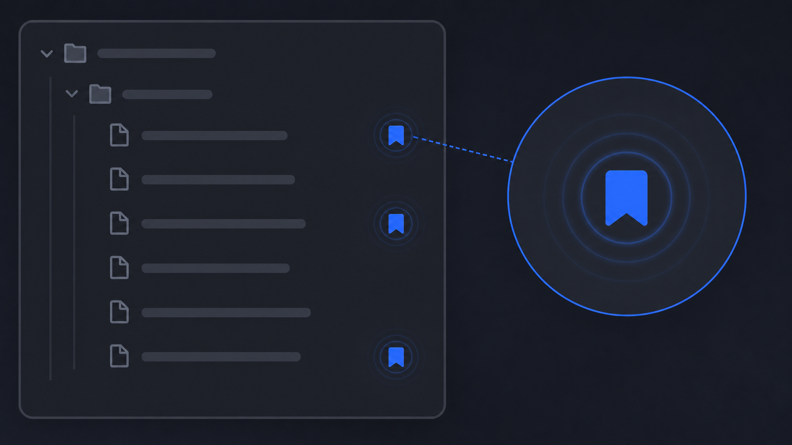

# Bookmark Indicator

Show a small blue bookmark marker beside files in Obsidian's core Bookmarks list. The marker appears in the File Explorer, making bookmarked notes easier to spot without opening the Bookmarks pane.

> The image is an illustrative example of the workflow, not a screenshot of the plugin.

## Install

1. Copy this folder to <vault>/.obsidian/plugins/bookmark-indicator/.
2. Ensure manifest.json, main.js, and styles.css are present.
3. Enable the core **Bookmarks** plugin.
4. Enable **Bookmark Indicator** under Settings → Community plugins.
5. Bookmark at least one file and open the File Explorer.

No build step or npm installation is required.

## How it works

- Reads Obsidian's .obsidian/bookmarks.json.
- Recursively extracts bookmarked file paths.
- Adds a blue marker to matching file rows.
- Refreshes on workspace and vault events, File Explorer changes, and a periodic bookmarks-file poll.

The indicator is intended for files, not folders or other bookmark item types.

## Troubleshooting

- Confirm the core Bookmarks plugin is enabled.
- Confirm the file is bookmarked in Obsidian's Bookmarks pane.
- Reload Obsidian or disable and re-enable the plugin.
- Check whether a theme or another plugin removed the File Explorer row's data-path attribute.

Compatibility was tested with Obsidian 1.11.5; behavior may vary with future File Explorer DOM changes.

## Uninstall

Disable the plugin, then remove its folder from .obsidian/plugins.

## License

MIT. See [LICENSE](LICENSE).

